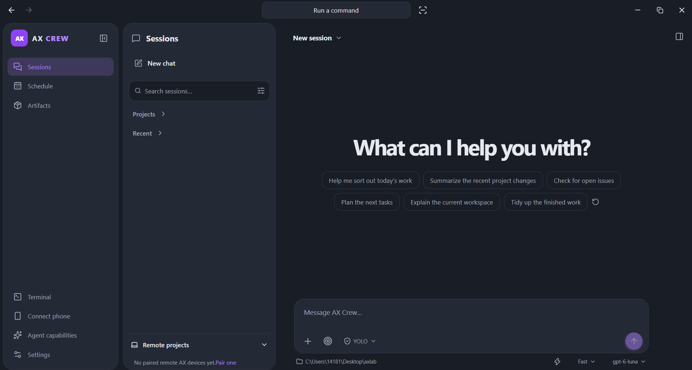
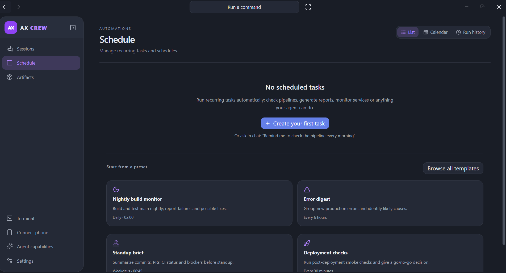
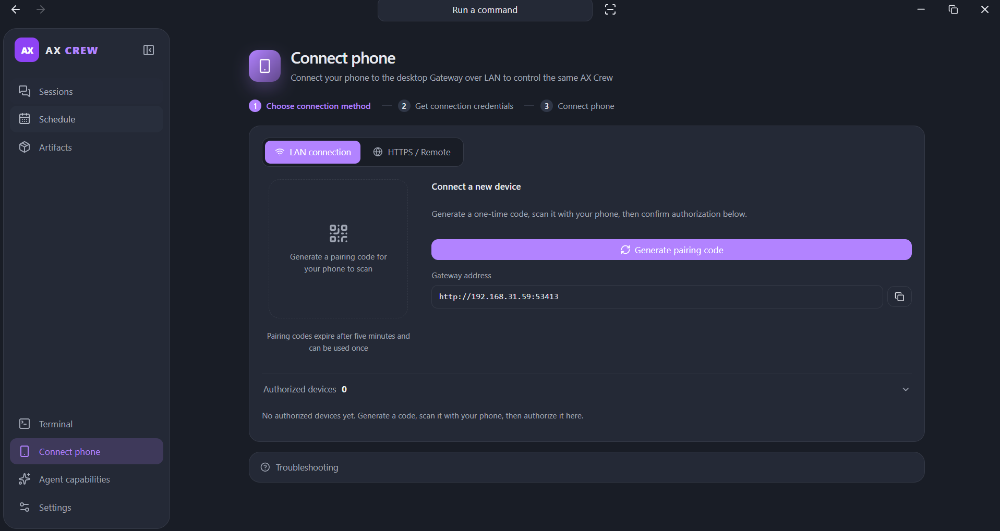

# AX Crew

用 Rust 编写的控制平面：连接、控制并编排分布在各台机器上的 AX Agent。

[](crates/server/Cargo.toml)
[](https://www.rust-lang.org)
[](https://github.com/Axium-Labs/AXCrew/releases/latest)

[English](README.md) | **简体中文**

[AX](https://github.com/Axium-Labs/AX) 是一个快速、原生的终端 Agent，可以在任意机器上运行——笔记本、构建服务器、GPU 服务器、云虚拟机。AX Crew 是它之上的控制平面：把各台机器配对、在它们之间委派任务、实时流转 Agent 的执行动态，并给你一个统一面板来掌控整个集群。两者一同开发、一同发布——Agent 运行时，以及协调它的控制平面。

- **统一控制面板** — 从单个桌面应用（或手机）驱动运行在笔记本、服务器、GPU 服务器与云虚拟机上的 AX。
- **会话文件** — 加宽的文件面板包含审查、工作目录文件树、多文件标签页与 Markdown 预览/源码切换；切到侧边聊天或详情后保留已打开文件。
- **系统指标** — 桌面端系统设置显示本机真实 CPU、内存、系统盘用量和运行时间，以及受支持 NVIDIA 显卡的使用率与显存；容量使用 GiB，读取失败明确显示不可用。
- **自适应工作区** — 统一分配多面板空间，优先保留聊天宽度，依次收起导航和 Sessions，再将 Files 切换为抽屉；聊天与文件预览可拖动调整比例并恢复默认，输入栏按自身容器宽度折叠次要操作。
- **设置开关** — 设置中的布尔选项与导入选择统一为右侧滑动开关，左侧展示标题及说明。
- **窗口关闭行为** — 默认关闭窗口后隐藏到托盘；在系统设置中关闭开关后，关闭窗口直接退出并停止本地服务。设置重启后保留，托盘菜单中的退出操作始终完全退出；设置卡片只保留关闭行为开关。
- **跨机器委派** — 把任务交给另一台机器；Crew 将该任务路由到那台机器的 AX，并把结果流式传回。
- **任务编排** — 确定性的任务 DAG：依赖、重试、取消与跨设备自动恢复。
- **自动化** — 夜间构建、错误摘要、站会简报、部署检查等周期性任务，从预设模板或自然语言聊天创建。
- **本地优先** — Agent 留在你的硬件上；每台机器各自持有自己的凭证、会话与记忆。没有"Agent 云"。

## 截图 / 拓扑



AX 在任务发生的地方运行；Crew 把机器连接起来，给你一个统一控制面板：

```text
   Laptop (AX)   Server (AX)   GPU Server (AX)   Cloud VM (AX)
        │             │              │                │
        └─────────────┴──────────────┴────────────────┘
                             ▼
                ┌──────────────────────────┐
                │      Crew Gateway        │
                │  pairing · routing ·     │
                │  DAG scheduling ·        │
                │  event streaming         │
                └────────────┬─────────────┘
                             │  REST / WebSocket
                ┌────────────▼─────────────┐
                │   Desktop client         │
                │   (+ Android client)     │
                └──────────────────────────┘
```

每台设备通过经认证的 WSS 配对；桌面端与 Android 客户端通过 REST/WebSocket 与网关通信。

## 什么是 AX Crew

AX Crew 是为 AX 打造的一个 Rust 控制平面。它与 AX 一起运行——同一台机器，或一台管理其他机器的主机——把分散的 AX 运行时变成一支"舰队"。

- **AX 是 Agent。** 它在自己的机器上拥有 Agent 循环、会话历史、记忆、工具、技能、MCP、模型、权限与凭证。
- **Crew 是控制平面。** 它连接机器（配对、身份、路由），控制它们（会话、权限、终端），并编排它们（任务 DAG、自动化、重试、取消）。
- **边界清晰。** Crew 不解读模型输出，不复制 AX 的完整 Session / Memory 或模型凭证；分布式协作只保存所需结果、检查点与明确发布的 Artifact。

## 为什么需要它

在一台机器上运行 AX 很容易。在五台上运行——笔记本做交互式工作、构建服务器跑长任务、GPU 服务器跑重活、云虚拟机做 24/7 自动化——你就需要一个控制平面。

- **让 Agent 在任务发生的地方运行。** 长构建与重负载跑在能扛得住的机器上；你留在笔记本前。
- **跨机器委派。** 把任务发给 Crew 的另一名成员并取回结果，无需拷贝文件、会话或凭证。
- **自动化例行工作。** 夜间构建、错误摘要、站会简报、部署检查按计划运行，汇总到同一个地方。
- **掌控权在你手里。** 在桌面端或手机上审批工具访问；每台机器各自持有凭证。
- **没有 Agent 云。** 仅仅为了"被协调"，你的 Agent 也无需运行在别人的基础设施上。

## 工作原理

1. **在每台机器上运行 AX。** 在你想放 Agent 的地方安装 AX；模型、凭证、技能与记忆都留在各机器本地。
2. **配对机器。** 在 Crew 中生成一次性配对码，然后在目标机器上执行 `ax crew pair <code> --gateway <url>` 一次，再执行 `ax crew connect <url>`。
3. **组建 Crew。** 把机器添加为成员，各自配置工作目录、模型与权限档位（`ask` / `allow` / `deny`）。
4. **创建任务。** 一个任务就是指派给某个成员的一条提示词。声明依赖形成 DAG；Crew 在前置任务全部完成后自动启动后续任务，并遵守每成员的并发上限。
5. **实时观察。** Crew 把实时事件——Agent 消息、工具调用、权限请求——流转到桌面端。
6. **必要时介入。** 批准或拒绝工具访问、取消任务、重试失败。若某台机器断开，其任务回到 `ready`，重连后恢复同一个 AX 会话。
7. **自动化可重复的事。** 从预设模板或自然语言聊天创建周期性任务。



## 快速开始

### 安装并运行

1. 在你想控制的机器上安装 [AX](https://github.com/Axium-Labs/AX)。
2. 安装 AX Crew——从 [GitHub Releases](https://github.com/Axium-Labs/AXCrew/releases/latest) 下载 Windows 安装包。
3. 打开 AX Crew，登录模型供应商，选择模型与工作目录，发送第一条消息。

### 添加另一台机器

在网关上生成一次性配对码，然后在第二台机器上执行：

```powershell
ax crew pair <code> --gateway https://crew.example.com
ax crew connect https://crew.example.com
```



`ax crew connect` 会自动重连。完整 API 与配对细节见 [docs/protocol/api.md](docs/protocol/api.md)。

## 安全

- **默认只绑定回环地址。** 网关默认绑定 loopback；任何非回环绑定都要求设置 `AX_CREW_ADMIN_TOKEN`，设置后所有 REST/WebSocket 路由都要求 `Authorization: Bearer <token>`。
- **传输加密。** 远程机器通过 HTTPS/WSS 连接，通常经你自己的反向代理；WSS 证书校验是强制的。
- **一次性配对。** 配对码五分钟内有效、只能用一次。
- **签名设备身份。** 设备通过 Ed25519 挑战认证；私钥永不进入 Crew 的数据库。
- **人工审批。** 工具访问遵循各成员的权限档位，可一次性授予、按会话授予或拒绝；未应答的请求会超时。
- **凭证隔离。** Crew 永远看不到供应商 API Key 或 OAuth token——它们只留在各台机器的 AX 安装中。

## AX 与 AX Crew

| | AX | AX Crew |
|---|---|---|
| 角色 | Agent 运行时 | 控制平面 |
| 范围 | 单台机器 | 多台机器 |
| 拥有 | Agent 循环、会话、记忆、工具、技能、MCP、模型、权限、凭证 | 设备身份、配对、任务 DAG、调度、事件、自动化 |
| 通信对象 | 模型与工具 | AX 运行时（ACP）与客户端（REST/WebSocket） |
| 给你什么 | 单台机器上的一个 Agent | 一支 Agent 舰队的统一面板 |

AX 负责思考；Crew 负责协调。两者可以运行在同一台机器或分开运行——AX 不需要云，Crew 也不额外引入任何 Agent。运行时一侧见 [AX README](https://github.com/Axium-Labs/AX)。

## 架构

AX Crew 是一个产品、三个交付物，只在稳定接口处交汇：

- `crates/server` — 控制平面：REST/WebSocket API、DAG 调度、存储、传输。唯一的 Cargo workspace 成员。
- `apps/desktop` — Tauri 2 + React 桌面客户端，带集成终端、调度与产物视图。
- `apps/android` — 原生 Android 控制客户端。

控制平面严格分层：`api/` → `orchestration/` → `storage/` → `domain/`，`transport/`、`gateway/`、`ax/` 是通信与 AX 适配边界。桌面端与 Android 只通过 API 访问控制平面。

仓库根目录只组织产品，自身不含代码。完整的仓库布局与模块职责见 [docs/architecture/README.md](docs/architecture/README.md)；Crew/AX 边界、schema 与状态机见 [docs/architecture/design.md](docs/architecture/design.md)。

## 文档

从 [docs/README.md](docs/README.md) 文档地图开始：

| 文档 | 主题 |
|---|---|
| [docs/architecture/README.md](docs/architecture/README.md) | 系统架构、分层、仓库布局 |
| [docs/protocol/api.md](docs/protocol/api.md) | REST/WebSocket API、认证、配对 |
| [docs/architecture/storage.md](docs/architecture/storage.md) | 数据库与持久化边界 |
| [docs/development/README.md](docs/development/README.md) | 构建、测试与打包 |
| [docs/desktop/README.md](docs/desktop/README.md) | 桌面设置与能力管理 |
| [docs/releases/0.3.0.md](docs/releases/0.3.0.md) | 版本快照 |

## 开发

需要 Rust 1.92+。仓库根是一个 Cargo workspace，唯一成员是 `crates/server`：

```powershell
cargo build
cargo test --workspace
```

完整的构建流程——桌面端、Android、打包——以及进程级测试见 [docs/development/README.md](docs/development/README.md)。

## 许可证

MIT。见 [crates/server/Cargo.toml](crates/server/Cargo.toml)。

## 可选的 Distributed Collaboration

AX 0.3.7 / AXCrew 0.3.3 新增侧边栏「分布式协作」与 `/api/distributed` 控制层，区分 Host、AX Instance 与 Execution；允许一台 Host 多个 AX，一个 AX 并发执行多个任务。AXCrew 结合 AX 能力和 Host 资源统一管理分配、租约、重试、取消与恢复。AX 通过 Durable Task、Event、Artifact、Workflow State 异步协作，无须高频直接通信或持续存活的 Coordinator Agent。在管理页注册实例、下载配置，在各机器运行 `ax crew worker worker.json`。普通 AX 和原有 Crew 控制方式仍可独立使用。见 [完整配置、API 与限制](docs/distributed-collaboration.md)。
